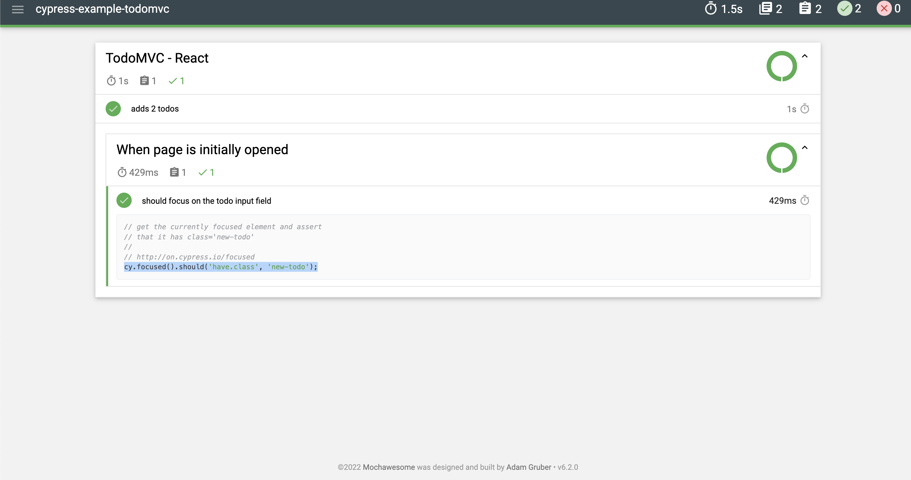

# Cypress Reporter Bug

Install project 

```bash
npm install
```

Start project
```bash
npm run start
```

Start single test and cypress reporter
```bash
npm run cy:run-one
```

Start long test cypress reporter
```
npm run e2e
```

Currently when you run project only generate json file instead of html. I try to change reporter option on cypress.json but it doesnt generate html with screenshot only generate json and output always shown folder with this name **reports/.json**

### Cypress json config 
```json
"reporterOptions": {
    "reportDir": "cypress/reports",
    "charts": true,
    "reportPageTitle": "My Test Suite",
    "embeddedScreenshots": true,
    "inlineAssets": true,
    "html":true,
    "json":false,
    "debug":true
  },
```

I changed node_module but this method isnt good I dont wanna change every time when I ```npm install``` Here the node_module settings that I changed.

**node_module/cypress-mochawesome-reporter/lib/reporter.js**

```js
const defaultReporterOptions = {
  overwrite: false,
  html: true,
  json: false,
};

```

Other problem screenshoots doesnt shown in the generated report. You can see below screenshot.


## Current Version
Node version = ``` v14.15.4 ```
Npm version = ```6.14.10 ```
